# Credit_Risk_Analysis UofT Data Analytics Bootcamp Module 17 Challenge

## Overview
### Purpose

The purpose of this analysis is to train and test different models on credit risk data to predict whether a loan will be paid back or not. The analysis will oversample with RandomOverSampler and SMOTE algorithms and undersample with ClusterCentroids algorithm. Then use a combinatorial apporach of over-under sampling using SMOTEENN algorithm. Then also use 2 machine learning models, BalancedRandomForest and EasyEnsembleClassifier.

## Results

Precision and recall score for high risk is reported as the majority of the samples are low risk and the ablity for the algorithm/model to pick out high risk is most relevant.

1. Naive Random Sampling
    - Balance Accuracy Score is 0.6464
    - Precision score for high risk is 0.01
    - Recall score for high risk is 0.71

2. SMOTE Sampling
    - Balance Accuracy Score is 0.6586
    - Precision score for high risk is 0.01
    - Recall score for high risk is 0.63

3. Cluster Centroid Sampling
    - Balance Accuracy Score is 0.5442
    - Precision score for high risk is 0.01
    - Recall score for high risk is 0.69

4. SMOTEENN Sampling
    - Balance Accuracy Score is 0.6480
    - Precision score for high risk is 0.01
    - Recall score for high risk is 0.72

5. Balanced Random Forest Model
    - Balance Accuracy Score is 0.7885
    - Precision score for high risk is 0.03
    - Recall score for high risk is 0.70

6. Easy Ensemble
    - Balance Accuracy Score is 0.9317
    - Precision score for high risk is 0.09
    - Recall score for high risk is 0.92

 
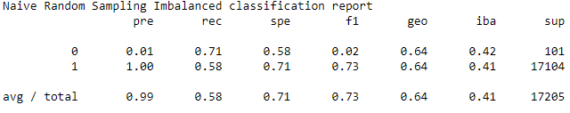 

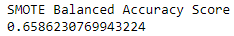 
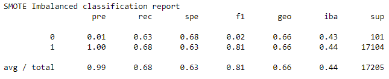 

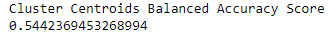 
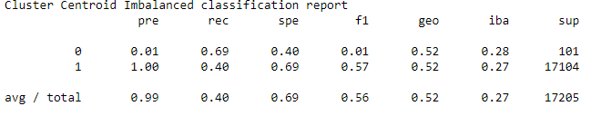 

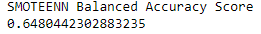 
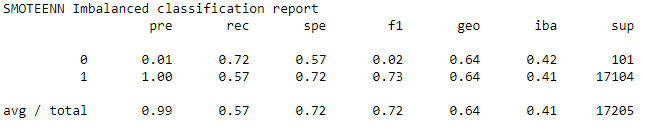 

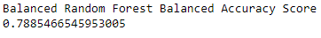 
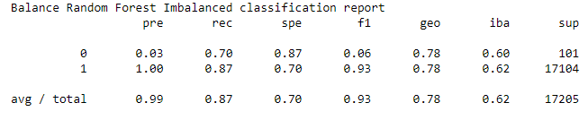 

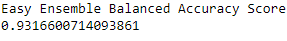 
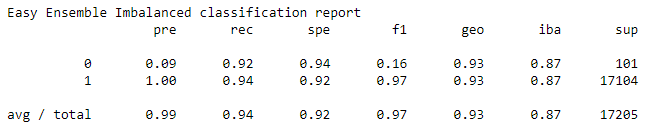 

## Summary

The 4 algorithms only picked out high risk loans less than 1% of the time. The 2 machine learning models did better at around 3% for the Balanced Random Forest Model and 9% with the Easy Ensemble model. None of the algorithms or models should be used as their ability to pick out high risk loans is low. Of note is that in this analysis the variables were not scaled nor were the variables analyzed for normality. 

